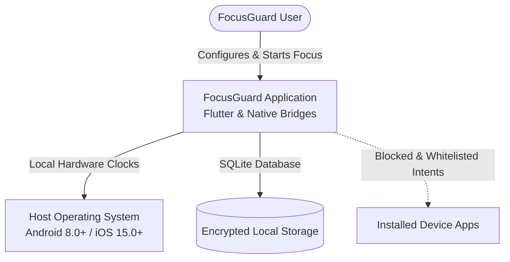
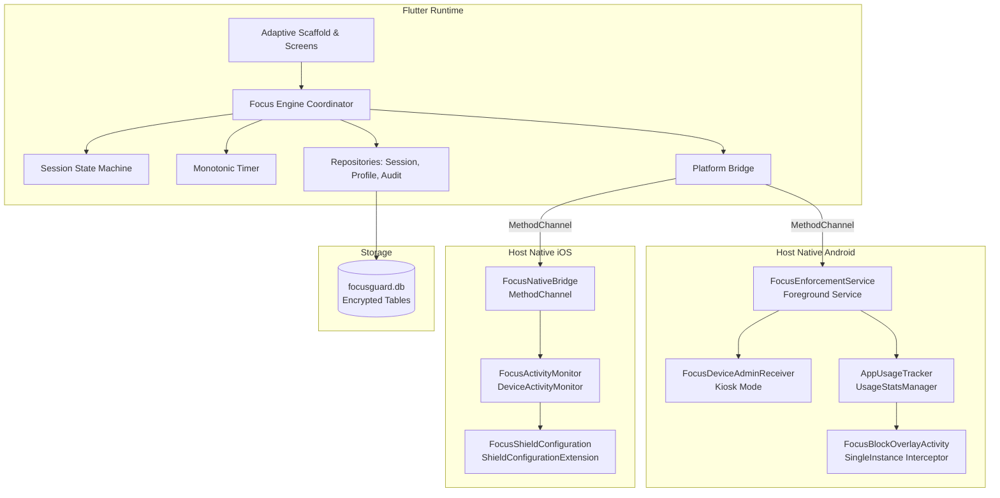
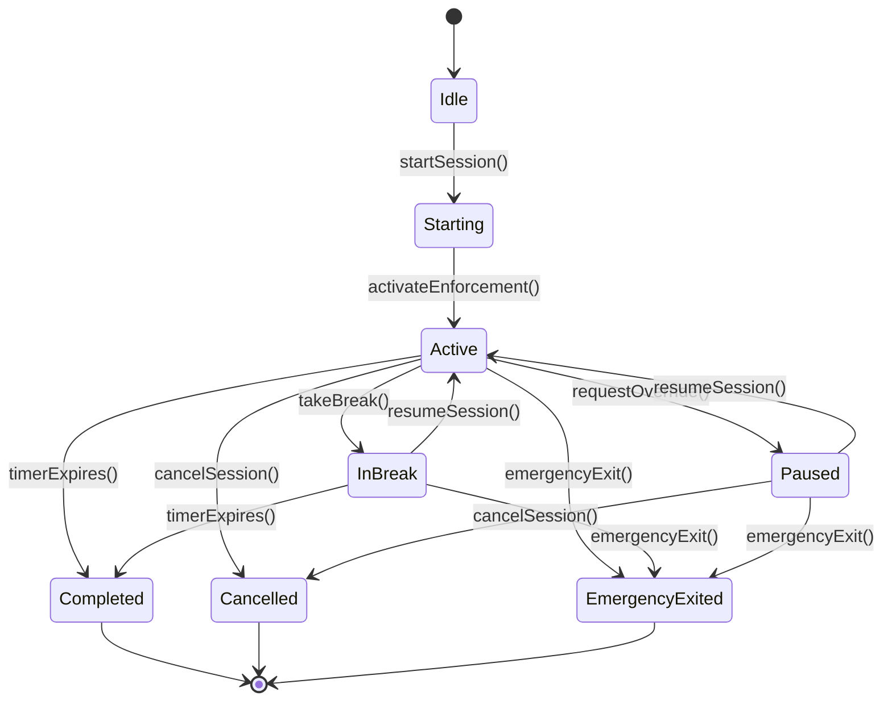

# FocusGuard - Architecture & System Design

## 1. Architectural Philosophy

FocusGuard is designed as a **Domain-Driven, Decoupled, Privacy-First Architecture**.
The system is divided into five strictly bounded layers:

1. **Presentation Layer (`lib/presentation/`)**: Responsive UI built with Flutter widgets, adaptive scaffolds, and high-performance custom painters. Completely decoupled from business logic via Provider and state change notifiers.
2. **Engine Layer (`lib/engine/`)**: Pure business orchestration controlling monotonic timers, state transitions, break budgets, daily limit calculations, and override coordinators.
3. **Domain Layer (`lib/domain/`)**: Immutable data models, value objects, domain enums, and formal deterministic state machine.
4. **Persistence Layer (`lib/persistence/`)**: Local relational SQLite storage with versioned migrations, atomic transactions, and tamper-evident audit logging.
5. **Platform Bridge Layer (`lib/platform/` & `android/` / `ios/`)**: Bidirectional native bridges using typed `MethodChannel` communicating with Android Foreground Services / Device Admin and iOS Screen Time APIs.

---

## 2. C4 Context & Container Diagrams

### 2.1 C4 Context

### 2.2 C4 Container Architecture

---

## 3. Deterministic Session State Machine

The session lifecycle is governed by an immutable, mathematically verified deterministic finite automaton (DFA) defined in `lib/domain/state_machine/session_state_machine.dart`.

### State Invariant Rules:
1. **No Circular Starting**: A session cannot move back to `starting` once `active`.
2. **Terminal Permanence**: `completed`, `cancelled`, and `emergencyExited` are strictly absorbing terminal states.
3. **Emergency Supremacy**: `emergencyExit()` can be dispatched from any operational state (`active`, `inBreak`, `paused`, `starting`) with zero barriers.
4. **Crash Recovery Reconciliation**: On boot or process revival, if monotonic time indicates expiration, the state machine forcibly reconciles to `completed`.

---

## 4. Hardware Monotonic Clock Synchronization

Standard system time (`DateTime.now()`) is vulnerable to user tampering (adjusting the phone's clock backward to bypass a timer) and NTP network jumps. FocusGuard solves this through hardware monotonic clocks:

- **Android**: `android.os.SystemClock.elapsedRealtime()` provides milliseconds elapsed since boot, including deep sleep.
- **iOS**: `mach_absolute_time()` / `CLOCK_MONOTONIC_RAW` provides unadjusted continuous ticks.
- **Flutter Fallback**: `Stopwatch` which binds to the host's monotonic reference.
- **Tamper Detector**: `lib/core/security/tamper_detector.dart` samples wall-clock vs monotonic progression on each tick. Any discrepancy greater than 3000ms triggers a tamper audit event.

---

## 5. Persistence Architecture

All relational entities are stored in `focusguard.db` using SQLite with WAL (Write-Ahead Logging) enabled:

1. **`sessions`**: Records session ID, profile ID, start/end timestamps, monotonic duration, remaining seconds, state, restriction level, and break counts.
2. **`profiles`**: Stores name, icon, restriction level, break quotas, and JSON arrays of blocked packages and allowed packages.
3. **`schedules`**: Defines recurring weekly schedules, active days bitmask, start/end minute of day, spanning midnight flags, and target profile ID.
4. **`daily_limits`**: Tracks package names, daily allowance minutes, spent minutes today, and threshold warning states.
5. **`audit_logs`**: Append-only log recording event types (`sessionStart`, `overrideAttempt`, `breakStart`, `tamperDetected`, `emergencyExit`), SHA-256 integrity hash, and sanitized metadata.
