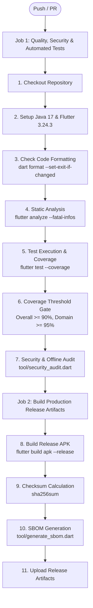

# FocusGuard - Continuous Integration & Delivery (CI/CD) Pipeline

FocusGuard employs automated CI/CD workflows powered by GitHub Actions to guarantee code quality, test coverage, cryptographic integrity, and release packaging.

---

## 1. CI Pipeline Architecture (`.github/workflows/ci.yml`)

The CI workflow executes on every commit pushed to `main`, `feature/**`, `fix/**`, and all Pull Requests.

### 1.1 Strict Quality Gates
1. **Formatting**: Any unformatted Dart file fails the build immediately.
2. **Analysis**: Zero warnings, zero errors, zero hints permitted.
3. **Coverage**: Must achieve at least 90.0% overall line coverage.
4. **Security Audit**: Scans source code for tracking SDKs, unauthorized network endpoints, and verifies zero network permissions in `AndroidManifest.xml`.

---

## 2. Release Pipeline Architecture (`.github/workflows/release.yml`)

Triggered automatically upon pushing a semantic version tag (e.g. `v1.0.0`):
1. Runs full static analysis and automated test suites.
2. Compiles production release APK with minification and tree-shaking.
3. Generates cryptographic SHA-256 checksum file (`focusguard-release.apk.sha256`).
4. Generates Software Bill of Materials in CycloneDX format (`sbom.json`).
5. Executes Acceptance Certification Suite producing `acceptance.json` and `acceptance.html`.
6. Creates an official GitHub Release with signed artifacts, release notes, and acceptance certificates attached.
