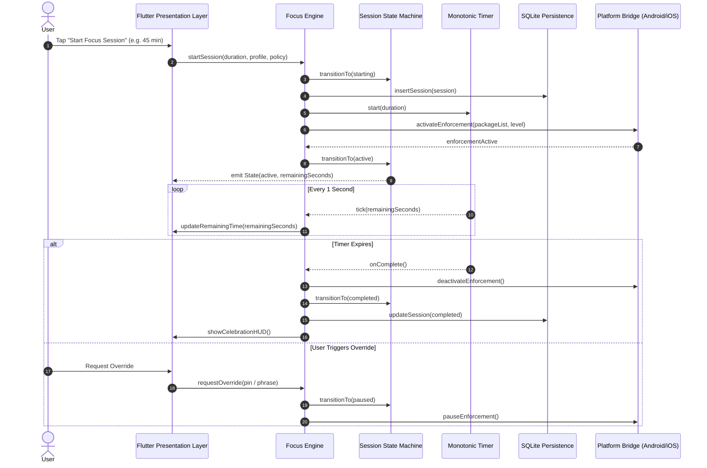

# FocusGuard - Exhaustive Product Specification

## 1. Executive Summary

FocusGuard is a digital wellbeing and behavioral commitment application. It is engineered to help individuals achieve sustained attention and deep work by deliberately creating intentional friction around smartphone and tablet usage.

Unlike commercial trackers that sell user attention through cloud telemetry, FocusGuard is built on a **zero-trust, 100% offline, privacy-first** foundation.

---

## 2. Core Functional Pillars

### 2.1 Focus Sessions
- **Duration**: Flexible durations from 1 minute to 24 hours, with 1-tap quick presets (15m, 25m Pomodoro, 45m Deep Work, 60m Study).
- **Session Types**: Scheduled, manual ad-hoc, and daily limit enforcement locks.
- **Session Lifecycle**: Deterministic state machine managing transitions across `idle`, `starting`, `active`, `inBreak`, `paused`, `completed`, `cancelled`, and `emergencyExited`.

### 2.2 Restriction Levels
1. **Gentle Mode**:
   - Focus: Subtle mindfulness prompts and soft reminders.
   - Interception: Dismissible dialog when attempting to open a restricted app.
   - Overrides: Instant 1-tap dismiss.
2. **Moderate Mode**:
   - Focus: Intentional friction for habit disruption.
   - Interception: Full-screen overlay blocking the restricted application.
   - Overrides: Mindful pause or short countdown friction (30-60s).
3. **Strict Mode**:
   - Focus: High commitment deep work.
   - Interception: Immediate interception with aggressive background suppression.
   - Overrides: Requires cryptographic PIN challenge, long delayed cooldown (1-15 minutes), or typing a 100-character mindful passage.
4. **Locked Mode (Kiosk / Device Lockdown)**:
   - Focus: Extreme commitment (exams, sleep hygiene, digital detox).
   - Interception: Kiosk-level lock using Android Device Admin / iOS Managed Settings.
   - Overrides: **Zero overrides permitted** until the timer naturally elapses, with the sole exception of the unblockable emergency dialer.

### 2.3 Emergency Dialer & Crisis Safety
- **Guaranteed Emergency Access**: FocusGuard's core architecture guarantees that telephone dialer intents (`tel:`, `ACTION_DIAL`, `ACTION_CALL_PRIVILEGED`) and emergency numbers (`911`, `112`, `999`, `988`) can **never** be intercepted, blocked, or restricted.
- **Fail-Safe Emergency Exit**: If a critical situation arises during a session, the user can invoke the Emergency Exit button. This immediately terminates all restrictions and logs an immutable entry in the local audit log.

### 2.4 Temporary Breaks
- **Break Quotas**: Each profile defines a maximum number of breaks (e.g., 2 per session) and a maximum duration per break (e.g., 5 or 10 minutes).
- **Countdown HUD**: During a break, an amber countdown ring visualizes remaining break time. When the break reaches zero, restrictions automatically resume.

### 2.5 Reusable Profiles
- **Work Profile**: Blocks social media, video streaming, and games; whitelists IDEs, productivity tools, and communication apps.
- **Study Profile**: Blocks web browsers, social media, and messaging; whitelists PDF readers, reference tools, and offline notes.
- **Sleep Profile**: High restriction strength (Locked mode) spanning overnight hours, disabling non-essential notifications and screen wakeups.
- **Custom Profiles**: Granular custom selection of individual packages and app categories.

### 2.6 Daily Usage & App Limits
- **Per-App Quotas**: Set daily minute limits on individual apps or categories (e.g., 45 minutes of Instagram per day).
- **Threshold Warnings**: Gentle notifications triggered at 80% and 90% of daily limit.
- **Automatic Session Trigger**: Once the daily limit is exhausted, an automatic focus restriction locks the specific app for the remainder of the calendar day.

---

## 3. Data Flow & Concurrency Model

---

## 4. Non-Functional Requirements & Constraints

1. **Zero Network Egress**: The application must never perform any HTTP/HTTPS/WebSocket communication.
2. **Deterministic State Recovery**: If the device reboots or the app is force-stopped, upon relaunch the engine must calculate the elapsed monotonic time and restore the exact correct state.
3. **Battery Consumption**: Daily background service execution must consume less than 2% of total battery capacity.
4. **Interception Latency**: App interception latency must be less than 200 milliseconds from when a blocked app reaches foreground.
