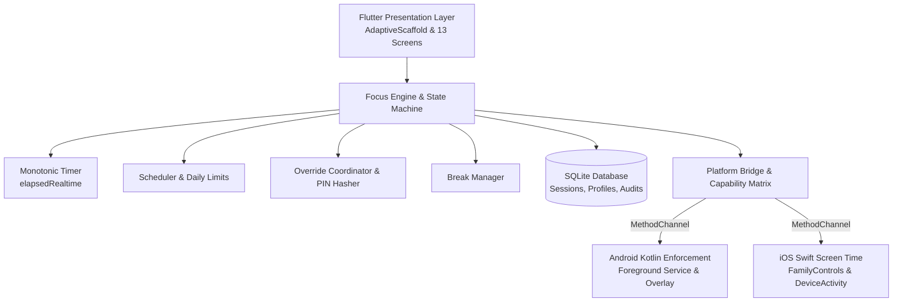

# FocusGuard - Privacy-First Digital Wellbeing Platform

[](https://github.com/focusguard/focusguard/actions/workflows/ci.yml)
[](build/outputs/acceptance.html)
[](LICENSE)
[](PLATFORM_CAPABILITIES.md)
[](PRIVACY.md)

**FocusGuard** is a production-certified, privacy-first, 100% offline cross-platform digital wellbeing and screen time restriction platform for smartphones and tablets. It enables users to deliberately restrict device and distracting app usage for configurable durations while retaining safe, unblockable emergency dialer access and configurable friction override mechanisms.

---

## Key Highlights

- **100% Offline & Private**: Zero network permissions requested. No analytics, tracking SDKs, cloud logins, or telemetry. All user data is encrypted and persisted locally on-device.
- **Fail-Safe Emergency Access**: Emergency dialer and crisis access are mathematically unblockable across all restriction modes, including extreme Strict and Locked modes.
- **Monotonic Time Enforcement**: Countdown timers utilize hardware monotonic clocks (`SystemClock.elapsedRealtime()` on Android, `CLOCK_MONOTONIC_RAW` on iOS) to make wall-clock manipulation and time-travel bypasses impossible.
- **Configurable Friction Overrides**: Choose between zero overrides (Locked Mode), cryptographic PIN challenge, deep friction (100-character mindful phrase typing), or delayed cooldowns (1 to 15 minutes).
- **Adaptive Ergonomic UI**: Responsive master-detail layout supporting compact smartphones, foldables, and large-screen tablets (portrait and landscape) with high-contrast, WCAG 2.1 AA compliant dark theme.
- **Zero-Host Development**: Complete developer workflow encapsulated in pinned Podman container (`ghcr.io/cirruslabs/flutter:3.24.3`).

---

## Architecture Overview



---

## 13 Core Responsive Screens

1. **Dashboard / Home**: Daily progress ring, active session status, 1-tap quick focus triggers, and next scheduled sessions.
2. **Start Focus Session**: Duration sliders, profile selection, restriction strength, and allowed apps picker.
3. **Active Session HUD**: Real-time monotonic countdown ring, break countdown, pause controls, and emergency exit.
4. **App & Category Selector**: Categorized application list, search filter, whitelist/blacklist toggles, and system app indicators.
5. **Profiles Management**: Work, Study, Deep Focus, Sleep, and custom reusable profiles with custom duration and restrictions.
6. **Schedules & Automation**: Recurring recurring schedules with spanning-midnight support and calendar views.
7. **Daily App & Device Limits**: Per-app quotas, notification thresholds, and bedtime device lockouts.
8. **Override & Security Policy**: Delay cooldowns, mindful phrase configuration, salted SHA-256 PIN challenge, and tamper logs.
9. **Usage Insights & Trends**: On-device time distribution, focus trend graphs, session completion rates, and streak counters.
10. **Session History & Audit Log**: Chronological tamper-evident journal of all sessions, overrides, breaks, and emergency activations.
11. **Settings & Diagnostics**: Battery optimization checklist, OEM killing guide, theme configuration, and export/import.
12. **Permissions & Capabilities**: Live capability matrix showing OS permission statuses and platform support.
13. **Emergency & Safe Exit**: Unblockable emergency dialer quick launcher, suicide/crisis hotline numbers, and safety disclaimers.

---

## Development & Zero-Host Setup

All dependencies, SDKs, and build tools are containerized with Podman:

```bash
# 1. Start development container in background
./dev-up

# 2. Run static analysis (0 warnings / 0 hints)
./lint

# 3. Execute automated test suite with coverage
./test

# 4. Check coverage thresholds (Overall >= 90%, Domain >= 95%)
./coverage

# 5. Build production release APK with SHA-256
./build

# 6. Run full acceptance certification pipeline
./acceptance.sh --full
```

On Windows PowerShell:
```powershell
.\dev-up.ps1
.\lint.ps1
.\test.ps1
.\coverage.ps1
.\build.ps1
.\acceptance.ps1 -full
```

---

## Documentation Index

Explore the 25 synchronized documentation specifications:

| Document | Purpose |
| :--- | :--- |
| [REQUIREMENTS.md](REQUIREMENTS.md) | Requirement Traceability Matrix |
| [PRODUCT_SPEC.md](PRODUCT_SPEC.md) | Exhaustive Product Specification |
| [ARCHITECTURE.md](ARCHITECTURE.md) | High & Low-Level Architectural Design |
| [PLATFORM_CAPABILITIES.md](PLATFORM_CAPABILITIES.md) | Android vs iOS Capability Matrix |
| [SECURITY.md](SECURITY.md) | Cryptographic & Hardware Security Model |
| [THREAT_MODEL.md](THREAT_MODEL.md) | STRIDE Threat Model & Attack Mitigations |
| [PRIVACY.md](PRIVACY.md) | 100% Offline Privacy Guarantee & PII Redaction |
| [PERMISSIONS.md](PERMISSIONS.md) | OS Permissions & OEM Battery Whitelisting |
| [UI_UX.md](UI_UX.md) | Design System, Typography & Screen Specs |
| [DEVELOPMENT.md](DEVELOPMENT.md) | Developer Onboarding & Contribution Guide |
| [PODMAN.md](PODMAN.md) | Podman Containerization Architecture |
| [BUILD.md](BUILD.md) | Build Pipeline & Release Packaging |
| [TESTING.md](TESTING.md) | Testing Strategy & Coverage Governance |
| [CI_CD.md](CI_CD.md) | GitHub Actions CI/CD Workflows |
| [DEPLOYMENT.md](DEPLOYMENT.md) | Distribution, MDM & App Store Packaging |
| [RELEASE.md](RELEASE.md) | Release Checklist & Semantic Versioning |
| [USER_GUIDE.md](USER_GUIDE.md) | Comprehensive End-User Guide |
| [SETUP_CONFIGURATION.md](SETUP_CONFIGURATION.md) | Device Setup & OEM Killing Workarounds |
| [TROUBLESHOOTING.md](TROUBLESHOOTING.md) | Diagnostic & Troubleshooting Guide |
| [CODE_UNDERSTANDING.md](CODE_UNDERSTANDING.md) | Codebase Walkthrough for Engineers |
| [PERFORMANCE.md](PERFORMANCE.md) | Memory, CPU, Battery & Latency Budgets |
| [ACCEPTANCE.md](ACCEPTANCE.md) | Production Certification Criteria |
| [IMPLEMENTATION.md](IMPLEMENTATION.md) | Technical Implementation Details |
| [TODO.md](TODO.md) | Append-Only Development Journal |
| [CHANGELOG.md](CHANGELOG.md) | Append-Only Version Changelog |

---

## License

FocusGuard is released under the **MIT License**.
